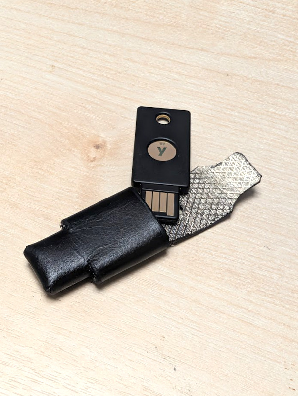
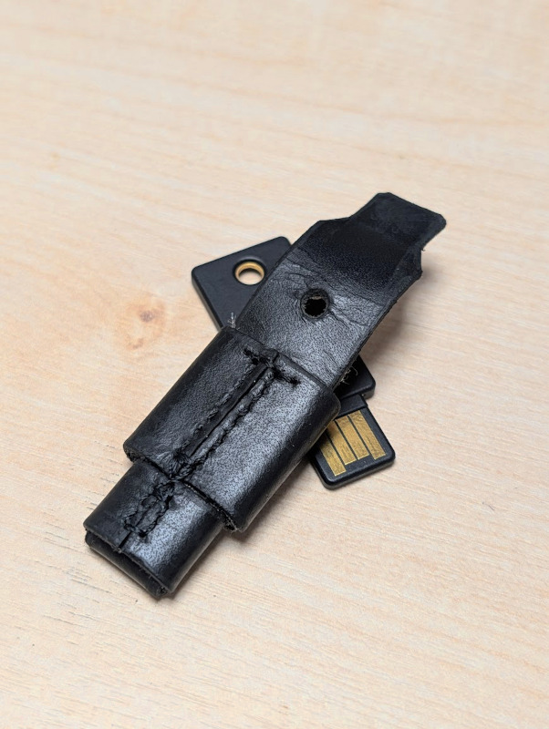

YubiKey 5 NFC Leather Sheath
===

## How to make

1. Download the pattern.
   1. [yubikey-5-nfc-leather-sheath.pdf](yubikey-5-nfc-leather-sheath.pdf)
   2. or you can download [yubikey-5-nfc-leather-sheath.lcc](yubikey-5-nfc-leather-sheath.lcc) if you have [Leathercraft CAD](https://coffee-craft.net/en/leathercraft_cad)
2. Inspect the pattern. See if some adjustments should be made. It's designed for 1T leather.
3. Transfer the pattern onto the leather.
4. Glue RF-blocking lining to the backside of the leather. (Optional)
5. Cut the leather.
6. Punch the lanyard hole.
7. Make stitch holes.
8. Stitch. It's basically a butt-jointed box shape, so butt stitch/box stitch can be used. Don't ask me why.
9. Finish with edge paints.
